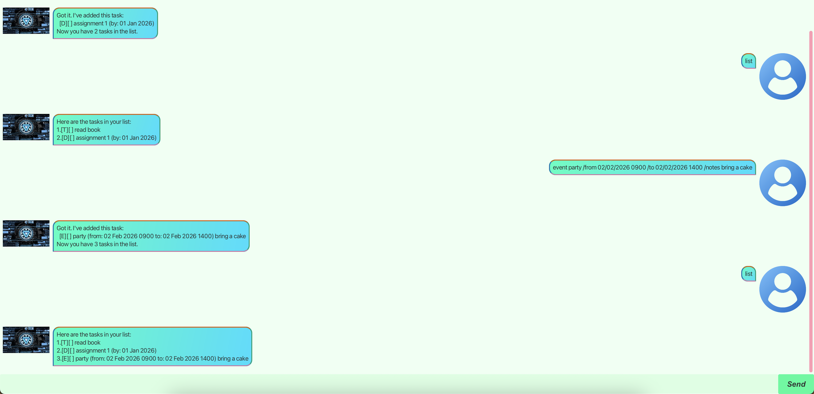

# Monday User Guide

Monday is a friendly desktop chatbot that helps you keep track of todos,
deadlines, and events using short text commands. Your tasks are saved
automatically, so they will still be there the next time you start Monday.



## Table of contents

- [Quick start](#quick-start)
- [Understanding the task list](#understanding-the-task-list)
- [Features](#features)
  - [Viewing your tasks: `list`](#viewing-your-tasks-list)
  - [Adding a todo: `todo`](#adding-a-todo-todo)
  - [Adding a deadline: `deadline`](#adding-a-deadline-deadline)
  - [Adding an event: `event`](#adding-an-event-event)
  - [Adding notes: `/notes`](#adding-notes-notes)
  - [Marking a task as done: `mark`](#marking-a-task-as-done-mark)
  - [Marking a task as not done: `unmark`](#marking-a-task-as-not-done-unmark)
  - [Finding tasks: `find`](#finding-tasks-find)
  - [Deleting a task: `delete`](#deleting-a-task-delete)
  - [Exiting Monday: `bye`](#exiting-monday-bye)
- [Saving your tasks](#saving-your-tasks)
- [Command summary](#command-summary)

## Quick start

1. Ensure that Java 25 or later is installed on your computer.
2. Download `monday.jar` from the latest release of Monday.
3. Move the JAR file into the folder where you want Monday to store its data.
4. Open a terminal in that folder and run:

   ```bash
   java -jar monday.jar
   ```

5. Type a command into the text box and press <kbd>Enter</kbd>, or click the
   **Send** button.

Here are a few commands you can try:

```text
todo Read chapter 1
deadline Submit report /by 30/09/2026 2359
event Project meeting /from 02/10/2026 1400 /to 02/10/2026 1500
list
```

## Understanding the task list

Monday labels each task with its type and completion status:

| Symbol | Meaning |
| --- | --- |
| `[T]` | Todo |
| `[D]` | Deadline |
| `[E]` | Event |
| `[ ]` | Not completed |
| `[X]` | Completed |

For example, `[D][X] Submit report (by: 30 Sep 2026 2359)` is a completed
deadline.

> **Note:** Commands and directives such as `todo` and `/by` must be typed in
> lowercase. Dates use `dd/MM/yyyy`, while optional times use the 24-hour
> `HHmm` format.

## Features

### Viewing your tasks: `list`

Shows every task and its task number. You will use these numbers with commands
such as `mark`, `unmark`, and `delete`.

**Format:** `list`

**Example:**

```text
list
```

### Adding a todo: `todo`

Adds a task without a fixed date or time.

**Format:** `todo DESCRIPTION [/notes NOTES]`

**Example:**

```text
todo Borrow a library book
```

### Adding a deadline: `deadline`

Adds a task that must be completed by a particular date. You may include a
time after the date.

**Format:** `deadline DESCRIPTION /by DATE [TIME] [/notes NOTES]`

**Examples:**

```text
deadline Renew passport /by 01/10/2026
deadline Submit report /by 30/09/2026 2359
```

### Adding an event: `event`

Adds an activity with a start and an end. Times are optional, but the end must
be after the start. Place `/from` before `/to`.

**Format:** `event DESCRIPTION /from DATE [TIME] /to DATE [TIME] [/notes NOTES]`

**Examples:**

```text
event Holiday /from 15/12/2026 /to 20/12/2026
event Project meeting /from 02/10/2026 1400 /to 02/10/2026 1500
```

### Adding notes: `/notes`

Adds extra information to a new todo, deadline, or event. The notes are shown
after the task details. Put `/notes` once, at the end of the command.

**Formats:**

```text
todo DESCRIPTION /notes NOTES
deadline DESCRIPTION /by DATE [TIME] /notes NOTES
event DESCRIPTION /from DATE [TIME] /to DATE [TIME] /notes NOTES
```

**Example:**

```text
deadline Submit report /by 30/09/2026 2359 /notes Attach the appendix
```

> **Tip:** `DESCRIPTION` and `NOTES` can contain spaces, but cannot contain the
> `|` character.

### Marking a task as done: `mark`

Marks the task at the given task number as completed. Run `list` first if you
need to check a task's number.

**Format:** `mark TASK_NUMBER`

**Example:** `mark 2`

### Marking a task as not done: `unmark`

Marks the task at the given task number as not completed.

**Format:** `unmark TASK_NUMBER`

**Example:** `unmark 2`

### Finding tasks: `find`

Shows tasks whose descriptions contain the given keyword or phrase. The search
is not case-sensitive, but it searches descriptions only—not notes, dates, or
times.

The numbers shown in the search results indicate the order of the matches, not
the tasks' numbers in the full list. Run `list` to check the correct task number
before using `mark`, `unmark`, or `delete`.

**Format:** `find KEYWORD`

**Examples:**

```text
find report
find project meeting
```

### Deleting a task: `delete`

Permanently removes the task at the given task number. Run `list` first to
confirm that you have the correct number.

**Format:** `delete TASK_NUMBER`

**Example:** `delete 3`

### Exiting Monday: `bye`

Saves your tasks, shows Monday's farewell message, and closes the application.

**Format:** `bye`

## Saving your tasks

Monday saves your task list automatically whenever you add, mark, unmark, or
delete a task. The data is stored in `data/monday.txt`, relative to the folder
from which you started the application. You do not need to save manually.

> **Warning:** Avoid editing `data/monday.txt` by hand. Invalid changes may
> prevent some tasks from loading correctly.

## Command summary

| Action | Format | Example |
| --- | --- | --- |
| View all tasks | `list` | `list` |
| Add a todo | `todo DESCRIPTION [/notes NOTES]` | `todo Borrow a book` |
| Add a deadline | `deadline DESCRIPTION /by DATE [TIME] [/notes NOTES]` | `deadline Submit report /by 30/09/2026 2359` |
| Add an event | `event DESCRIPTION /from DATE [TIME] /to DATE [TIME] [/notes NOTES]` | `event Meeting /from 02/10/2026 1400 /to 02/10/2026 1500` |
| Mark as done | `mark TASK_NUMBER` | `mark 2` |
| Mark as not done | `unmark TASK_NUMBER` | `unmark 2` |
| Find tasks | `find KEYWORD` | `find report` |
| Delete a task | `delete TASK_NUMBER` | `delete 3` |
| Exit Monday | `bye` | `bye` |
